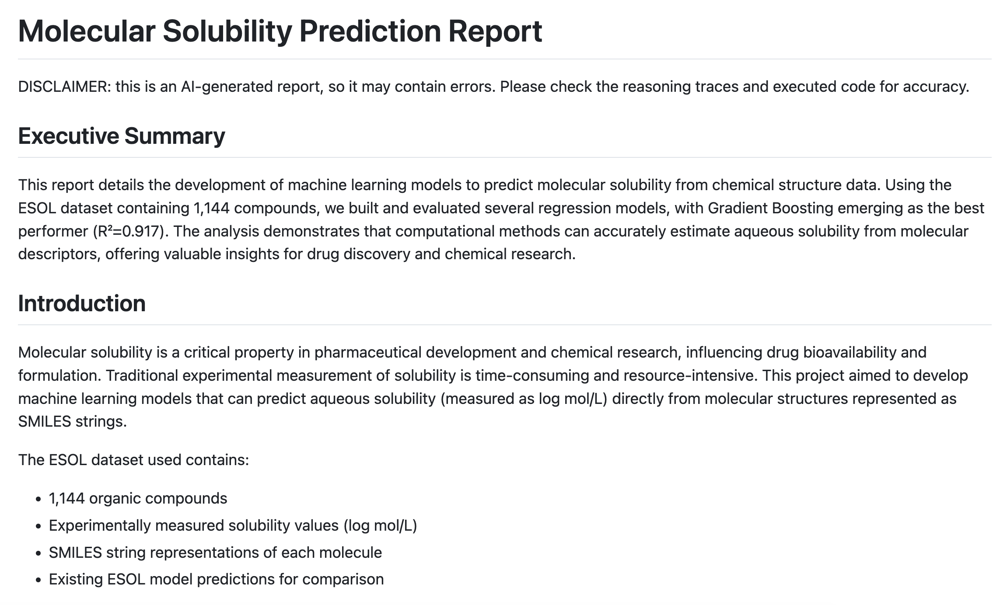
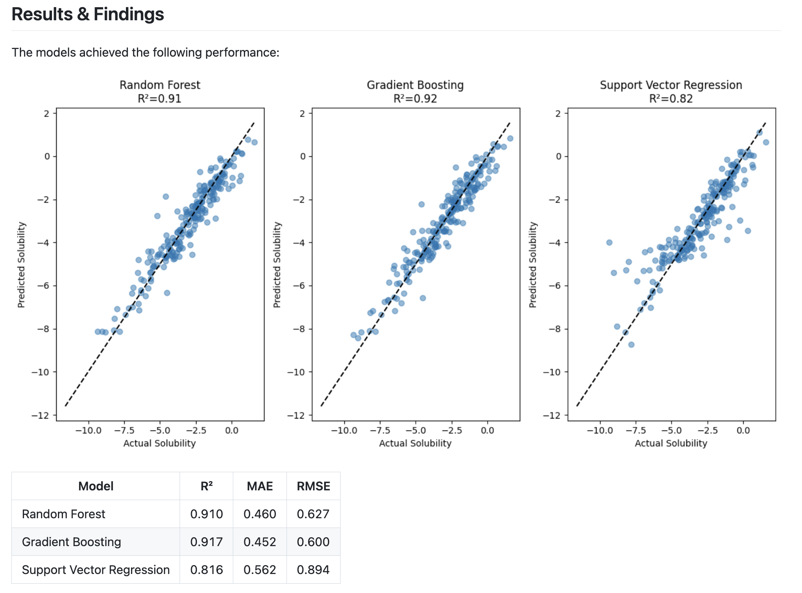

# Together Open Data Scientist

An AI-powered data analysis assistant that follows the ReAct (Reasoning + Acting) framework to perform comprehensive data science tasks. The agent can execute Python code either locally via Docker or in the cloud using [Together Code Interpreter (TCI)](https://www.together.ai/code-interpreter).

## ⚠️ Experimental Software Notice

**This is an experimental tool** powered by large language models. Please be aware of the following limitations:

- **AI-Generated Code**: All analysis and code is generated by AI and may contain errors, bugs, or suboptimal approaches
- **No Guarantee of Accuracy**: Results should be carefully reviewed and validated before making important decisions
- **Learning Tool**: Best suited for exploration, learning, and initial analysis rather than production use
- **Human Oversight Required**: Always verify outputs, especially for critical business or research applications
- **Evolving Technology**: Capabilities and reliability may vary as the underlying models are updated

## 🚀 Quick Start

### Install Together Open Data Scientist using PyPI
   ```bash
   pip install open-data-scientist
   ```
### Run Together Open Data Scientist using command line and TCI
   ```bash
   # export together api key
   export TOGETHER_API_KEY="your-api-key-here"

   # run the agent
   open-data-scientist --executor tci --write-report
   ```

## 📖 Example Output

Our Open Data Scientist can perform comprehensive data analysis and generate detailed reports. Below is an example of a complete analysis report for molecular solubility prediction (see [the example](examples/solubility_prediction/)):

### Report Example




## 🤖 Install from Source

### Prerequisites

- Python 3.12 or higher
- [uv](https://docs.astral.sh/uv/) - Fast Python package manager
- Together AI API key (get one at [together.ai](https://together.ai))
- Docker and Docker Compose (for local execution mode)

### Installation

####  Clone the repository:
   ```bash
   cd open-data-scientist
   ```

####  Install the package:
   ```bash
   # Install uv (faster alternative to pip)
   curl -LsSf https://astral.sh/uv/install.sh | sh

   # Create and activate virtual environment
   uv venv --python=3.12
   source .venv/bin/activate
   uv pip install -e .
   ```

####  Set up your API key:
   ```bash
   export TOGETHER_API_KEY="your-api-key-here"
   ```

#### (Optional, needed when using docker for code execution) Docker Mode Setup

⚠️ Important: Docker mode has session isolation limitations and security considerations for local development. (1) Session isolation: While user variables are isolated between sessions, module modifications and global state changes affect all sessions. (2) Host directory access: The container has read-write access to specific host directories. (3)Best for: Single-user local development and data analysis workflows. For detailed technical information, security warnings, and setup instructions, see the [Interpreter README](interpreter/README.md).
1. launch docker service:
   ```bash
   cd interpreter
   docker-compose up --build -d
   ```

2. Stop services:
   ```bash
   docker-compose down
   ```


 

#### Usage

1. Command Line Interface (CLI): The easiest way to get started is using the command line interface

```bash
# Basic usage with local Docker execution
open-data-scientist

# Use cloud execution with TCI
open-data-scientist --executor tci

# Specify a custom model and more iterations
open-data-scientist --model "deepseek-ai/DeepSeek-V3" --iterations 15

# Use specific data directory
open-data-scientist --data-dir /path/to/your/data

# Combine options
open-data-scientist --executor tci --model "meta-llama/Meta-Llama-3.1-405B-Instruct-Turbo" --iterations 20 --data-dir ./my_data
```

CLI Options

| Option | Short | Description | Default |
|--------|-------|-------------|---------|
| `--model` | `-m` | Language model to use | `deepseek-ai/DeepSeek-V3` |
| `--iterations` | `-i` | Maximum reasoning iterations | `20` |
| `--executor` | `-e` | Execution mode: `tci` or `internal` | `internal` |
| `--data-dir` | `-d` | Data directory to upload | Current directory (with confirmation) |
| `--session-id` | `-s` | Reuse existing session ID | Auto-generated |
| `--help` | `-h` | Show help message | - |


2. Python API: For programmatic usage, you can also use the Python API directly

```python
from open_data_scientist.codeagent import ReActDataScienceAgent

# Cloud execution with TCI
agent = ReActDataScienceAgent(
    executor="tci",
    data_dir="path/to/your/data",  # Optional: auto-upload files
    max_iterations=10
)

# Local execution with Docker
agent = ReActDataScienceAgent(
    executor="internal", 
    data_dir="path/to/your/data",  # Optional: auto-upload files
    max_iterations=10
)

result = agent.run("Explore the uploaded CSV files and create summary statistics")
```

## 🎯 Execution Modes

The ReAct agent supports two execution modes for running Python code:

| Feature | TCI (Together Code Interpreter) | Docker/Internal |
|---------|--------------------------------|-----------------|
| **Execution Location** | ☁️ Cloud-based (Together AI) | 🏠 Local Docker container |
| **Setup Required** | API key only | Docker + docker-compose |
| **File Handling** | ☁️ Files uploaded to cloud | 🏠 Files stay local |
| **Session Persistence** | ✅ Managed by Together | ✅ Local session management |
| **Session Isolation** | ✅ Independent isolated sessions | ⚠️ Limited isolation (see below) |
| **Concurrent Usage** | ✅ Multiple users/processes safely | ⚠️ File conflicts possible |
| **Dependencies** | Pre-installed environment | Custom Docker environment |
| **Plot Saving** | ✅ Can save created plots to disk | ❌ Plots not saved to disk |

## ⚠️ Important Privacy Warning

**TCI Mode**: Using TCI will upload your files to Together AI's cloud servers. Only use this mode if you're comfortable with your data being processed in the cloud.

**Docker Mode**: All code execution and file processing happens locally in your Docker container. For detailed technical information, security warnings, and setup instructions, see the [Interpreter README](interpreter/README.md)