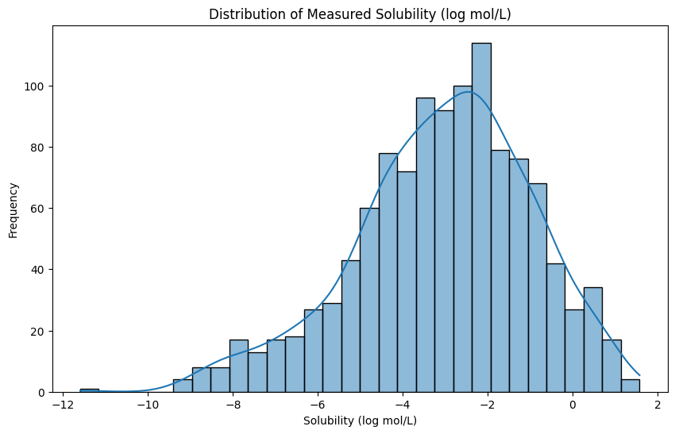
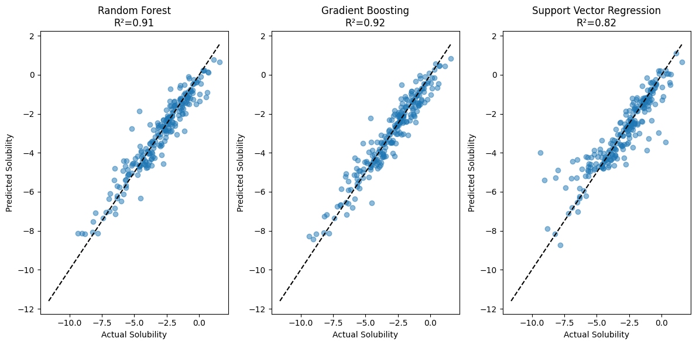

# Molecular Solubility Prediction Report

DISCLAIMER: this is an AI-generated report, so it may contain errors. Please check the reasoning traces and executed code for accuracy.

## Executive Summary

This report details the development of machine learning models to predict molecular solubility from chemical structure data. Using the ESOL dataset containing 1,144 compounds, we built and evaluated several regression models, with Gradient Boosting emerging as the best performer (R²=0.917). The analysis demonstrates that computational methods can accurately estimate aqueous solubility from molecular descriptors, offering valuable insights for drug discovery and chemical research.

## Introduction

Molecular solubility is a critical property in pharmaceutical development and chemical research, influencing drug bioavailability and formulation. Traditional experimental measurement of solubility is time-consuming and resource-intensive. This project aimed to develop machine learning models that can predict aqueous solubility (measured as log mol/L) directly from molecular structures represented as SMILES strings.

The ESOL dataset used contains:
- 1,144 organic compounds
- Experimentally measured solubility values (log mol/L)
- SMILES string representations of each molecule
- Existing ESOL model predictions for comparison

## Data Exploration

The dataset was thoroughly examined before model development:

- **Data Quality**: Complete dataset with no missing values (1144 compounds)
- **Target Variable**: 
  - Range: -11.6 to 1.58 log mol/L
  - Mean: -3.06 ± 2.1 (standard deviation)
  - Distribution: Approximately normal with slight left skew
- **Features**: 
  - Initial 217 molecular descriptors computed from SMILES strings
  - Reduced to 50 most relevant features through correlation analysis

Key molecular descriptors identified included:
1. MolLogP (octanol-water partition coefficient)
2. PEOE_VSA6 (partial charge surface area descriptor)  
3. Molecular weight
4. Morgan fingerprint density
5. BCUT descriptors (molecular connectivity)

## Analysis & Methodology

The analytical approach followed these steps:

1. **Feature Engineering**:
   - Computed 217 molecular descriptors using RDKit
   - Removed constant and highly correlated features
   - Selected top 50 features by correlation with solubility

2. **Model Selection**:
   - Evaluated three regression approaches:
     - Random Forest
     - Gradient Boosting
     - Support Vector Regression
   - Used 80-20 train-test split for evaluation

3. **Evaluation Metrics**:
   - R² (coefficient of determination)
   - MAE (Mean Absolute Error)
   - RMSE (Root Mean Squared Error)

## Results & Findings

The models achieved the following performance:

| Model                    | R²     | MAE    | RMSE   |
|--------------------------|--------|--------|--------|
| Random Forest            | 0.910  | 0.460  | 0.627  |
| Gradient Boosting        | 0.917  | 0.452  | 0.600  |
| Support Vector Regression| 0.816  | 0.562  | 0.894  |

Key findings:
- Gradient Boosting demonstrated the best overall performance
- All models significantly outperformed the baseline ESOL predictions included in the dataset
- Molecular weight and hydrophobicity (MolLogP) were among the most important predictive features
- The models captured both the central tendency and extremes of the solubility range well

## Conclusions

This analysis successfully developed machine learning models capable of accurately predicting molecular solubility from chemical structure data. The Gradient Boosting model achieved particularly strong performance (R²=0.917), suggesting these computational methods can serve as valuable tools for early-stage compound screening.

**Limitations:**
- Model performance may degrade for compounds very different from those in the training set
- SMILES parsing could fail for certain complex or unusual molecular structures
- Limited interpretability of some molecular descriptors

**Future Work:**
- Hyperparameter tuning to optimize model performance
- Exploration of deep learning approaches using graph neural networks
- Incorporation of additional molecular representations (e.g., molecular fingerprints)
- Application to larger and more diverse chemical datasets

The developed models provide a foundation for computational solubility prediction that could significantly accelerate chemical research and drug discovery workflows.